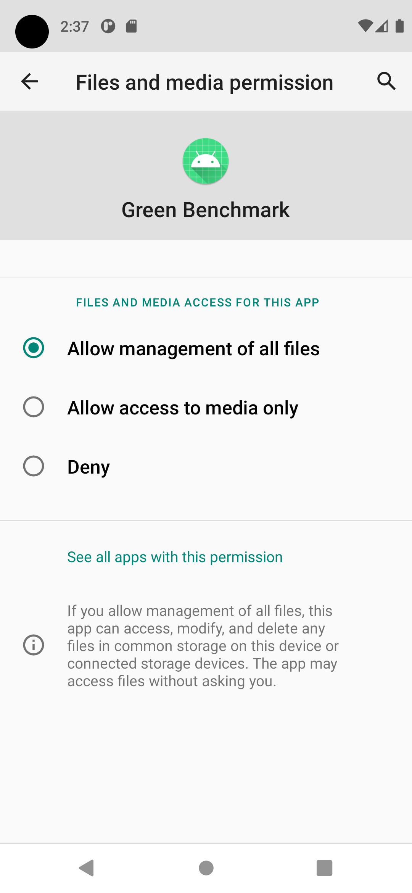

# benchmark-android-app
Android APP benchmark

## Running 

When running the App for the first time, it's necessary to grant some permissions. In addition, after installing it on the device, it's also necessary to go to the App settings and grant special permission to "manage all files" 

## <a id="test-configuration">Test configuration</a>
The first screen of the App allows the configuration of some parameters used during the execution of the benchmark tests:

* <a id="test-load">Test load</a> -> how many iterations to run.

* <a id="media-file">Media file</a>  -> a video file must be informed to run in the specific scenario.

* <a id="upload-file">Upload File</a> -> any file must be selected (image, video, document, txt, etc.) to be used in a specific scenario.

## <a id="scenarios">Scenarios</a>

- **User login** - A form (login) is filled with predefined credentials and sent for authentication on the server via API Rest. It returns a JWT that is saved in the App's internal preferences.

- **Form Submission** - A form (user account) is completed and sent for registration in a Rest API. Returns saved Account object containing ID in JSON format.

- **File download** - A download request is made via Rest API to the server. Returns a stream of bytes (form-data) that is saved to on-device storage (/Downloads).

- **File upload** - A POST request is performed by sending a stream of bytes (form-data) via the Rest API. The file to upload must be selected during initial setup for [upload-file](#upload-file). The server should save the file correctly. Returns a JSON with the saved file data (name, url).

- **Playing media (Video)** - Plays a previously selected [media-file](#media-file)